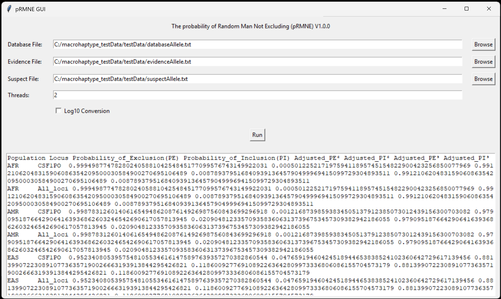
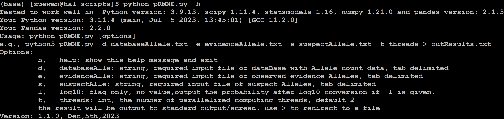

# pRMNE
# The probability of Random Man Not Excluding (pRMNE)

A novel bioinformatics and statistical tool for calculating the pRMNE of suspect's alleles in a DNA mixture at a scene based on multiple loci alleles and population frequency. The output provides the statistical discrimination power in probability for DNA forensics. 

The tool is programmed in Python3.

## Installation

The tool is programmed in Pyhton v3.9. No installation is needed. It can be run after downloading from Github using the following command in a command terminal.

` git clone https://github.com/XuewenWangUGA/pRMNE`

or click the download button on the GitHub page to download the .zip file, then uncompress the downloaded file.

## Dependencies
The pRMNE requires Python packages. The tested Python and packages are Python version 3.9.13, scipy 1.11.4, pandas 2.1.3. To install these packages before running the pRMNE:

`pip install scipy`

`pip install pandas`

## Systems

The pRMNE can be run in the following computing systems:

* Windows
* MacOS
* Linux

## Interface

The tool comes with a command interface and graphic interface. User can use either to run the tool.

For graphic interface: to type the command in a command terminal

`python pRMNE_GUI.py`

For command interface: See section blow.

## How to use

Usage: 

`python pRMNE.py [options]`

e.g. using the testing data

`python3 pRMNE.py -d databaseAllele.txt -e evidenceAllele.txt -s suspectAllele.txt -t 2 > outResults.txt`

Options:
    
        -h, --help: show this help message and exit
        -d, --databaseAlle: string, required input file of dataBase with Allele count data, tab delimited
        -e, --evidenceAlle: string, required input file of observed evidence Alleles, tab delimited
        -s, --suspectAlle: string, required input file of suspect Alleles, tab delimited
        -l, --log10: flag only, no value,output the probability after log10 conversion if -l is given.
        -t, --threads: int, the number of parallelized computing threads, default 2
         the result will be output to the standard output/screen. use > to redirect to a file
    
## Output

The output is a tab-separated text file. The data is the not excluded and exclusion probability of a random man in each super population at each STR locus site and all combined sites for  26 populations (FIN,CDX,IBS,MXL,CHB,CHS,CEU,JPT,ESN,KHV,TSI,CLM,YRI,GBR,PEL,STU,BEB,GIH,PJL,MSL,ITU,GWD,LWK,ASW,PUR,ACB), 5 supperpopulations (EAS, EUR, AFR,SAS, AMR).

e.g. for AFR (Africa population): 20 CODIS loci and  All loci combined at a p-value 8.23071958151542135332E-36

    Population	Locus	Probability_of_Exclusion(PE)	Probability_of_Inclusion(PI)	Adjusted_PE²	Adjusted_PI²	Adjusted_PE³	Adjusted_PI³
    AFR	CSF1PO	9.99943467691785855616E-1	5.65323082141443835152E-5	9.93217121942747780534E-1	6.78287805725221946563E-3	9.93217121942747780534E-1	6.78287805725221946563E-3
    AFR	D10S1248	9.99777233236801069280E-1	2.22766763198930719537E-4	9.93316271208893620440E-1	6.68372879110637956039E-3	9.93316271208893620440E-1	6.68372879110637956039E-3
    AFR	D12S391	9.99943467691785855616E-1	5.65323082141443835152E-5	9.93266787826630159409E-1	6.73321217336984059149E-3	9.93266787826630159409E-1	6.73321217336984059149E-3
    AFR	D13S317	9.99943467691785855616E-1	5.65323082141443835152E-5	9.93217121942747780534E-1	6.78287805725221946563E-3	9.93217121942747780534E-1	6.78287805725221946563E-3
    AFR	D16S539	9.99777233236801069280E-1	2.22766763198930719537E-4	9.84961610220010645989E-1	1.50383897799893540109E-2	9.84961610220010645989E-1	1.50383897799893540109E-2
    AFR	D18S51	9.99943467691785855616E-1	5.65323082141443835152E-5	9.84738524371182506202E-1	1.52614756288174937977E-2	9.84738524371182506202E-1	1.52614756288174937977E-2
    AFR	D19S433	9.99777233236801069280E-1	2.22766763198930719537E-4	9.73265084835574481758E-1	2.67349151644255182415E-2	9.73265084835574481758E-1	2.67349151644255182415E-2
    AFR	D1S1656	9.99943467691785855616E-1	5.65323082141443835152E-5	9.98304280485686945134E-1	1.69571951431305486641E-3	9.98304280485686945134E-1	1.69571951431305486641E-3
    AFR	D21S11	9.99943467691785855616E-1	5.65323082141443835152E-5	9.93217121942747780534E-1	6.78287805725221946563E-3	9.93217121942747780534E-1	6.78287805725221946563E-3
    AFR	D22S1045	9.99943467691785855616E-1	5.65323082141443835152E-5	9.93217121942747780534E-1	6.78287805725221946563E-3	9.93217121942747780534E-1	6.78287805725221946563E-3
    AFR	D2S1338	9.99777233236801069280E-1	2.22766763198930719537E-4	9.73265084835574481758E-1	2.67349151644255182415E-2	9.73265084835574481758E-1	2.67349151644255182415E-2
    AFR	D2S441	9.99777233236801069280E-1	2.22766763198930719537E-4	9.73265084835574481758E-1	2.67349151644255182415E-2	9.73265084835574481758E-1	2.67349151644255182415E-2
    AFR	D3S1358	9.99943467691785855616E-1	5.65323082141443835152E-5	9.93266787826630159409E-1	6.73321217336984059149E-3	9.93266787826630159409E-1	6.73321217336984059149E-3
    AFR	D5S818	9.99943467691785855616E-1	5.65323082141443835152E-5	9.93217121942747780534E-1	6.78287805725221946563E-3	9.93217121942747780534E-1	6.78287805725221946563E-3
    AFR	D7S820	9.99943467691785855616E-1	5.65323082141443835152E-5	9.84738524371182506202E-1	1.52614756288174937977E-2	9.84738524371182506202E-1	1.52614756288174937977E-2
    AFR	D8S1179	9.99943467691785855616E-1	5.65323082141443835152E-5	9.84738524371182506202E-1	1.52614756288174937977E-2	9.84738524371182506202E-1	1.52614756288174937977E-2
    AFR	FGA	9.99943467691785855616E-1	5.65323082141443835152E-5	9.98304280485686945134E-1	1.69571951431305486641E-3	9.98304280485686945134E-1	1.69571951431305486641E-3
    AFR	TH01	9.99777233236801069280E-1	2.22766763198930719537E-4	9.84961610220010645989E-1	1.50383897799893540109E-2	9.84961610220010645989E-1	1.50383897799893540109E-2
    AFR	TPOX	9.99777233236801069280E-1	2.22766763198930719537E-4	9.84961610220010645989E-1	1.50383897799893540109E-2	9.84961610220010645989E-1	1.50383897799893540109E-2
    AFR	vWA	9.99943467691785855616E-1	5.65323082141443835152E-5	9.84813068822410803974E-1	1.51869311775891960257E-2	9.84813068822410803974E-1	1.51869311775891960257E-2
    AFR	All_loci	1.00000000000000000000E+0	8.23071958151542135332E-36	1.00000000000000000000E+0	4.38875716538970662812E-41	1.00000000000000000000E+0	4.38875716538970662812E-41

## Funding

This work was sponsored in part by the award 15PNIJ-21-GG-04159-RESS, awarded by the National Institute of Justice, Office of Justice Programs, U.S. Department of Justice.

## Citation

Coming soon

## Support

Version: 1.1.0, Dec,5th,2023
Contact: xwang.kib@gmail.com or xuewen.wang@unthsc.edu 
